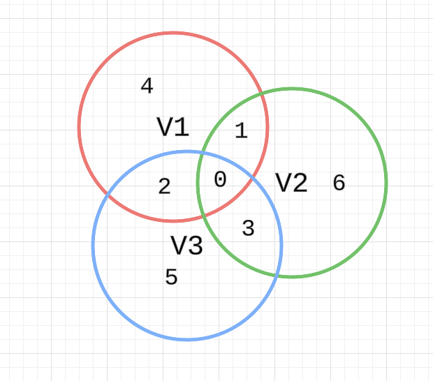

# Chapter 2 Finite-Dimensional Vector Spaces

## 2A Span and Linear Independence

### 2A.6

Show that the list $(2, 3, 1), (1, −1, 2), (7, 3, 𝑐)$ is 
linearly dependent in $𝐅^3$ if and only if $𝑐 = 8$.

**Proof**:

$$
\begin{cases}
    2a + 1b + 7d = 0 &\text{}\\
    3a - 1b + 3d = 0 &\text{}\\
    1a + 2b + cd = 0 &\text{}\\
\end{cases} 
$$

So $a = -2d, b = -3d$. Then $c = 8$.

### 2A.7

(a) Show that if we think of $𝐂$ as a vector space over 
$𝐑$, then the list
$1 + 𝑖, 1 − 𝑖$ is linearly independent.

**Proof**:

Assume

$$ 
a_1 (1+i) + a_2(1-i) = 0
$$

Then

$$ 
\begin{cases}
    a_1 + a_2 = 0 &\text{}\\
    a_1 - a_2 = 0 &\text{}\\
\end{cases}
$$

So $a_1 = a_2 = 0$.

$\square$

(b) Show that if we think of $𝐂$ as a vector space over $𝐂$, 
then the list $1 + 𝑖, 1 − 𝑖$ is linearly dependent.

**Proof**:

Note $(1-i)(1+i) + (-(1+i))(1-i) = 0$.

$\square$

### 2A.8

Suppose $𝑣_1, 𝑣_2, 𝑣_3, 𝑣_4$ is linearly independent in $𝑉$. Prove that the list

$$ 
𝑣_1 − 𝑣_2, 𝑣_2 − 𝑣_3, 𝑣_3 − 𝑣_4, 𝑣_4
$$

is also linearly independent.

**Proof**:

We have

$$ 
a_1 (𝑣_1 − 𝑣_2) + a_2 (𝑣_2 − 𝑣_3) + a_3 (𝑣_3 − 𝑣_4) + a_4 𝑣_4 = 0 \\
\Longleftrightarrow \\
a_1 𝑣_1 + (a_2 - a_1) 𝑣_2 + (a_3 - a_2) 𝑣_3 + (a_3 - a_4) 𝑣_4 = 0 \\
\Longleftrightarrow \\
a_1 = a_2 - a_1 = a_3 - a_2 = a_4 - a_3 = 0 \\
\Longleftrightarrow \\
a_1 = a_2 = a_3 = a_4 = 0
$$

$\square$

### 2A.9

Prove or give a counterexample: If
$𝑣_1, 𝑣_2, …, 𝑣_𝑚$ is a linearly independent
list of vectors in $𝑉$, then

$$ 
5𝑣_1 − 4𝑣_2, 𝑣_2, 𝑣_3, …, 𝑣_𝑚
$$

is linearly independent.

**Proof**:

$$ 
a_1 (5𝑣_1 − 4𝑣_2) + a_2 𝑣_2 + a_3 𝑣_3 + \cdots + a_m 𝑣_m = 0 \\
\Longleftrightarrow \\
5 a_1 = a_2 - 4 a_1 = a_3 = \cdots = a_m = 0 \\ 
\Longleftrightarrow \\
a_1 = a_2 = a_3 = \cdots = a_m = 0
$$

$\square$

### 2A.10

Prove or give a counterexample:
If $𝑣_1, 𝑣_2, …, 𝑣_𝑚$ is a linearly independent
list of vectors in $𝑉$ and $𝜆 ∈ 𝐅$ with $𝜆 ≠ 0$, then
$𝜆𝑣_1, 𝜆𝑣_2, …, 𝜆𝑣_𝑚$ is linearly independent.

**Proof**:

$$ 
a_1 (𝜆𝑣_1) + a_2 (𝜆𝑣_1) + \cdots + a_m (𝜆𝑣_m) = 0 \\
\Longleftrightarrow \\
(a_1𝜆) 𝑣_1 + (a_2𝜆) 𝑣_2 + \cdots + (a_m𝜆) 𝑣_m = 0 \\
\Longleftrightarrow \\
a_1𝜆 = a_2𝜆 = \cdots = a_m𝜆 = 0 \\
\Longleftrightarrow \\
a_1 = a_2 = \cdots = a_m = 0 \\
$$

$\square$

### 2A.11

Prove or give a counterexample: If
$𝑣_1, …, 𝑣_𝑚$ and $𝑤_1, …, 𝑤_𝑚$ are linearly
independent lists of vectors in $𝑉$ , then the list
$𝑣_1 + 𝑤_1, …, 𝑣_𝑚 + 𝑤_𝑚$ is linearly independent.

**Solution**:

Counterexample:

Let

$$ 
𝑣_1 = (1, 0), 𝑣_2 = (0, 1) \\
w_1 = (0, 1), w_2 = (1, 0)
$$

Then

$$ 
𝑣_1 + 𝑤_1 = (1, 1) = 𝑣_2 + 𝑤_2
$$

$\square$

## 2A.12

Suppose $v_1, \cdots, v_m$ is linearly independent in $𝑉$ 
and $𝑤 ∈ 𝑉$. Prove that if
$v_1 + w, \cdots, v_m + w$ is linearly dependent, then
$w \in \text{span}(𝑣_1, \cdots, 𝑣_𝑚)$.

**Proof**:

$v_1 + w, \cdots, v_m + w$ is linearly dependent, then
we can find $a_1, \cdots, a_m$, not all $0$, such that,

$$ 
a_1(v_1 + w) + \cdots + a_m(v_m + w) = 0 \\
\Longleftrightarrow \\
(a_1 v_1 + \cdots + a_m v_m) + (a_1 + \cdots + a_m)w = 0
$$

If $a_1 + \cdots + a_m = 0$, then
$a_1 v_1 + \cdots + a_m v_m = 0$, we have a contradition. 

Then $a_1 + \cdots + a_m \neq 0$.

So $w \in \text{span}(𝑣_1, \cdots, 𝑣_𝑚)$.

$\square$

### 2A.13

Suppose $v_1, \cdots, v_m$ is linearly independent in $𝑉$ 
and $𝑤 ∈ 𝑉$. Show that

$v_1, \cdots, v_m, w$ is linearly independent if and only if

$$
w \not\in \text{span}(𝑣_1, \cdots, 𝑣_𝑚).
$$

**Proof**:

$\Rightarrow$

We prove by contradition.
If $w \in \text{span}(𝑣_1, \cdots, 𝑣_𝑚)$, then

$$ 
w = a_1 v_1 + \cdots + a_m v_m
$$

So

$$ 
a_1 v_1 + \cdots + a_m v_m + (-1)w = 0
$$

Then we have the contradition.

$\Leftarrow$

We prove by contradition.

Assume
$v_1, \cdots, v_m, w$ is linearly dependent. Then

$$ 
a_1 v_1 + \cdots + a_m v_m + aw = 0
$$

If $a = 0$, then $v_1, \cdots, v_m$ is linearly dependent.
We have a contradition. So $a \neq 0$.
Then $w \in \text{span}(𝑣_1, \cdots, 𝑣_𝑚)$.

$\square$

### 2A.14

Suppose $v_1, \cdots, v_m$ is a list of vectors in $𝑉$. For $𝑘 ∈ \{1, …, 𝑚\}$, let

$$ 
w_k = v_1 + \cdots + v_k
$$

Show that the list $v_1, \cdots, v_m$ is linearly independent if and only if the list
$w_1, \cdots, w_m$ is linearly independent.

**Proof**:

$\Rightarrow$

if

$$ 
a_1 w_1 + \cdots + a_m w_m = 0 \\
\Longleftrightarrow \\
a_m = 0, a_{m} + a_{m-1} = 0, \cdots, a_1 + \cdots + a_m = 0 \\
\Longleftrightarrow \\
a_1 = \cdots = a_m = 0
$$

$\Leftarrow$

$$ 
a_1 v_1 + \cdots + a_m v_m = 0 \\
\Longleftrightarrow \\
a_1 (w_2 - w_1) + \cdots + a_m (w_m - w_{m-1}) = 0 \\
\Longleftrightarrow \\
a_m = 0, a_{m-1} - a_m = 0, \cdots, a_2 - a_1 = 0, a_1 = 0 \\
\Longleftrightarrow \\
a_1 = \cdots = a_m = 0
$$

$\square$

### 2A.15

Explain why there does not exist a list of six polynomials that is linearly independent in $𝒫_{4}(𝐅)$.

**Proof**:

$$ 
1, z, z^2, z^3, z^4
$$

spans $𝒫_{4}(𝐅)$. From 2.22,
length of linearly independent list $≤$
length of spanning list.

$\square$

### 2A.16

Explain why no list of four polynomials spans $𝒫_{4}(𝐅)$.

**Proof**:

If a list of four polynomials spans $𝒫_{4}(𝐅)$, then

$$ 
1, z, z^2, z^3, z^4
$$

has to be linearly dependent, which is not the case.

$\square$

### 2A.17

Prove that $𝑉$ is infinite-dimensional if and only if there 
is a sequence $𝑣_1, 𝑣_2, …$ of vectors in $𝑉$ such that 
$v_1, \cdots, v_m$ is linearly independent for every positive
integer $𝑚$.

**Proof**:

$\Rightarrow$

We start with any $v_1 \neq 0$. If we cannot find $v_2$,
such that $v_1, v_2$ is linearly independent, then
$v_1$ spans $V$ we have contradition.

This step can continue, assume we find
$v_1, \cdots, v_m$ are linearly independent, since it
does not span $V$, we can find $v_{m+1} \not\in \text{span}(𝑣_1, \cdots, 𝑣_𝑚)$, then from exercise 2A.13,
$v_1, \cdots, v_m, v_{m+1}$ is still linearly independent.

$\Leftarrow$

We prove by contradition, if $V$ is finite-dimensional,
then some list of vectors in it spans the space $V$.
Assume for this list has $m-1$ vectors.

But we can find $v_1, \cdots, v_m$ are linearly independent,
from 2.22, we have a contradition.

$\square$

### 2A.18

Prove that $𝐅^∞$ is infinite-dimensional.

**Proof**:

We can construct a sequence

$$ 
v_1 = (1, 0, 0, \cdots) \\
v_2 = (0, 1, 0, \cdots) \\
v_3 = (0, 0, 1, \cdots) \\
$$

$\square$

### 2A.19

Prove that the real vector space of all continuous 
real-valued functions on the interval $[0, 1]$ is 
infinite-dimensional.

**Proof**:

We can construct a sequence

$$ 
f_n(x) =
\begin{cases}
    \triangle &\text{if } x \in [\frac{1}{n+1}, \frac{1}{n}] \\
    0 &\text{otherwise } \\
\end{cases} 
$$

$\square$

### 2A.20

Suppose $p_0, \cdots, p_m$ are polynomials in
$𝒫_{m}(𝐅)$ uch that $𝑝_𝑘(2) = 0$ for each
$k \in \{0, \cdots, m\}$.
Prove that $p_0, \cdots, p_m$ is not linearly independent in
$𝒫_{m}(𝐅)$.

**Proof**:

Since $p_0(2) = 0$, we can write

$$ 
p_0(z) = (z-2) q_0(z)
$$

And note $q_0 \in 𝒫_{m-1}(𝐅)$. Since $1, z, \cdots, z^{m-1}$ spans $𝒫_{m-1}(𝐅)$, then
$q_0, \cdots, q_m$ is linearly dependent. We can find

$$ 
a_0 q_0 + \cdots + a_m q_m = 0
$$

So

$$ 
a_0 p_0 + \cdots + a_m p_m = 0
$$

$\square$

## 2C Dimension

### 2C.11

Suppose 𝑈 and 𝑊 are both four-dimensional subspaces of $𝐂^6$ . Prove that
there exist two vectors in $𝑈 ∩ 𝑊$ such that neither of these vectors is a scalar
multiple of the other.

**Proof**:

$$ 
\dim (𝑈 ∩ 𝑊) = \dim (U) + \dim (W) - \dim (U+W) \geq 4 + 4 - 6 = 2
$$

$\square$

### 2C.12

Suppose that 𝑈 and 𝑊 are subspaces of $𝐑^8$ such that $\dim 𝑈 = 3$, $\dim 𝑊 = 5$,
and $𝑈 + 𝑊 = 𝐑^8$ . Prove that $𝐑^8 = 𝑈 ⊕ 𝑊$.

**Proof**:

$$ 
\dim (𝑈 ∩ 𝑊) = \dim (U) + \dim (W) - \dim (U+W) = 3 + 5 - 8 = 0
$$

So $𝑈 ∩ 𝑊 = \{0\}$. Then $𝐑^8 = 𝑈 ⊕ 𝑊$.

$\square$

### 2C.13

Suppose 𝑈 and 𝑊 are both five-dimensional subspaces of $𝐑^9$ . Prove that
$𝑈 ∩ 𝑊 ≠ \{0\}$.

**Proof**:

$$ 
\dim (𝑈 ∩ 𝑊) = \dim (U) + \dim (W) - \dim (U+W) \geq 5 + 5 - 9 = 1
$$

So $𝑈 ∩ 𝑊 ≠ \{0\}$.

$\square$

### 2C.14

Suppose 𝑉 is a ten-dimensional vector space and $𝑉_1, 𝑉_2, 𝑉_3$ are subspaces
of $𝑉$ with $\dim 𝑉_1 = \dim 𝑉_2 = \dim 𝑉_3 = 7$. Prove that $𝑉_1 ∩ 𝑉_2 ∩ 𝑉_3 ≠ \{0\}$.

**Proof**:

$$ 
\dim (𝑉_1 ∩ 𝑉_2 ∩ 𝑉_3) = \dim (𝑉_1 ∩ 𝑉_2) + \dim (V_3) - \dim ((𝑉_1 ∩ 𝑉_2) + V_3) \\
= \dim (V_1) + \dim (V_2) + \dim (V_3) - \dim (𝑉_1 \cup 𝑉_2) - \dim ((𝑉_1 ∩ 𝑉_2) + V_3) \\
\geq 21 - 10 - 10 = 1
$$

$\square$

### 2C.15

Suppose 𝑉 is finite-dimensional and $𝑉_1, 𝑉_2, 𝑉_3$ are subspaces of 𝑉 with
$\dim 𝑉_1 + \dim 𝑉_2 + \dim 𝑉_3 > 2 dim 𝑉$ . Prove that $𝑉_1 ∩ 𝑉_2 ∩ 𝑉_3 ≠ \{0\}$.

**Solution**:

Exactly them as exercise 2C.14.

$\square$

### 2C.16

Suppose 𝑉 is finite-dimensional and 𝑈 is a subspace of 𝑉 with $𝑈 ≠ 𝑉$. Let
$𝑛 = \dim 𝑉$ and $𝑚 = \dim 𝑈$. Prove that there exist $𝑛 − 𝑚$ subspaces of 𝑉,
each of dimension $𝑛 − 1$, whose intersection equals 𝑈.

**Proof**:

Let $u_1, \cdots, u_m$ be a basis of $U$, and we extend it to a basis of $V$ by adding
$v_1, \cdots, v_{n-m}$.

Consider the following subspaces

$$ 
V_1 = \text{span}(u_1, \cdots, u_𝑚, v_2, v_3, \cdots, v_{n-m}) \\
V_2 = \text{span}(u_1, \cdots, u_𝑚, v_1, v_3, \cdots, v_{n-m}) \\
\cdots \\
V_{n-m} = \text{span}(u_1, \cdots, u_𝑚, v_1, v_2, \cdots, v_{n-m-1}) \\
$$

Since $u_i \in V_j$, the intersection W contains $U$.

Assume $w \in W$, then it can be the linear combination of these $n-m$ basis.
Since the combination is unique, the coefficients for $v_1, \cdots, v_{n-m}$ has to be 0.

Then $w$ is in $U$.

$\square$

### 2C.17

Suppose that $𝑉_1, …, 𝑉_𝑚$ are finite-dimensional subspaces of 𝑉. Prove that
$𝑉_1 +⋯ + 𝑉_𝑚$ is finite-dimensional and

$$ 
\dim(𝑉_1 +⋯ + 𝑉_𝑚) ≤ \dim 𝑉_1 +⋯ + \dim 𝑉_𝑚.
$$

**Proof**:

Just use induction and 2.43.

$$ 
\dim(𝑉_1 +⋯ + 𝑉_𝑚) = \dim(𝑉_1 +⋯ + 𝑉_{𝑚-1}) + \dim 𝑉_𝑚 - \dim((𝑉_1 +⋯ + 𝑉_{𝑚-1}) \cap 𝑉_𝑚)
\leq \dim(𝑉_1 +⋯ + 𝑉_{𝑚-1}) + \dim 𝑉_𝑚 \leq \dim 𝑉_1 +⋯ + \dim 𝑉_𝑚
$$

$\square$

### 2C.18

Suppose 𝑉 is finite-dimensional, with $\dim 𝑉 = 𝑛 ≥ 1$. Prove that there exist
one-dimensional subspaces $𝑉_1, …, 𝑉_𝑛$ of $𝑉$ such that
$𝑉 = 𝑉_1 ⊕ ⋯ ⊕ 𝑉_𝑛$.

**Proof**:

Assume $v_1, \cdots, v_n$ is a basis of $V$. Let $V_i = \text{span}(𝑣_i)$.

First $V = V_1 + \cdots + V_n$, because $v_1, \cdots, v_n$ is a basis.

Second, since $v_1, \cdots, v_n$ is a basis, the representation is unique.

So $𝑉 = 𝑉_1 ⊕ ⋯ ⊕ 𝑉_𝑛$.

$\square$

### 2C.19

Explain why you might guess, motivated by analogy with the formula 
for the number of elements in the union of three finite sets, that 
if $𝑉_1, 𝑉_2, 𝑉_3$ are subspaces of a finite-dimensional vector 
space, then 

$$ 
\begin{align*}
\dim(𝑉_1 + 𝑉_2 + 𝑉_3) 
&= \dim 𝑉_1 + \dim 𝑉_2 + \dim 𝑉_3 \\
& - \dim(𝑉_1 ∩ 𝑉_2) − \dim(𝑉_1 ∩ 𝑉_3) − \dim(𝑉_2 ∩ 𝑉_3) \\
& + \dim(𝑉_1 ∩ 𝑉_2 ∩ 𝑉_3)\\
\end{align*} 
$$

**Solution**:

Consider the following diagram.

$$ 
\dim 𝑉_1 = A_0 + A_1 + A_2 + A_4 \\
\dim 𝑉_2 = A_0 + A_1 + A_3 + A_6 \\
\dim 𝑉_3 = A_0 + A_2 + A_3 + A_5 \\
\dim 𝑉_1 ∩ 𝑉_2 = A_0 + A_1 \\
\dim 𝑉_2 ∩ 𝑉_3 = A_0 + A_3 \\
\dim 𝑉_1 ∩ 𝑉_3 = A_0 + A_2 \\
\dim 𝑉_1 ∩ 𝑉_2 ∩ 𝑉_3 = A_0 \\
$$

### 2C.20

Prove that if $𝑉_1$, $𝑉_2$, and $𝑉_3$ are subspaces of a 
finite-dimensional vector space, then

$$ 
\begin{align*}
\dim(𝑉_1 + 𝑉_2 + 𝑉_3) 
&= \dim 𝑉_1 + \dim 𝑉_2 + \dim 𝑉_3 \\
& - \frac{\dim(𝑉_1 ∩ 𝑉_2) + \dim(𝑉_1 ∩ 𝑉_3) + \dim(𝑉_2 ∩ 𝑉_3)}{3} \\
& - \frac{
\dim((𝑉_1 + 𝑉_2) ∩ 𝑉_3) + \dim((𝑉_1 + 𝑉_3) ∩ 𝑉_2) +
\dim((𝑉_2 + 𝑉_3) ∩ 𝑉_1)
}{3} \\
\end{align*} 
$$

**Proof**:

Again consider the diagram above

$$ 
\dim 𝑉_1 ∩ 𝑉_2 = A_0 + A_1 \\
\dim 𝑉_2 ∩ 𝑉_3 = A_0 + A_3 \\
\dim 𝑉_1 ∩ 𝑉_3 = A_0 + A_2 \\
\dim((𝑉_1 + 𝑉_2) ∩ 𝑉_3) = A0 + A2 + A3 \\
\dim((𝑉_1 + 𝑉_3) ∩ 𝑉_2) = A0 + A1 + A3 \\
\dim((𝑉_2 + 𝑉_3) ∩ 𝑉_1) = A0 + A1 + A2 \\
$$

$\square$
